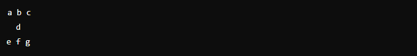
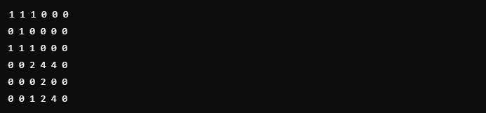

# Soma da ampulheta

O problema trata de encontrar a soma máxima de uma "ampulheta" em um array 2D. Uma ampulheta é uma submatriz de 7 elementos com o seguinte formato:

O objetivo é percorrer o array, identificar todas as possíveis ampulhetas, calcular a soma de seus elementos e, em seguida, exibir a maior soma encontrada.

Exemplo:\
Dado o array:

As somas das ampulhetas seriam calculadas, e a maior soma (19) corresponde à ampulheta:

